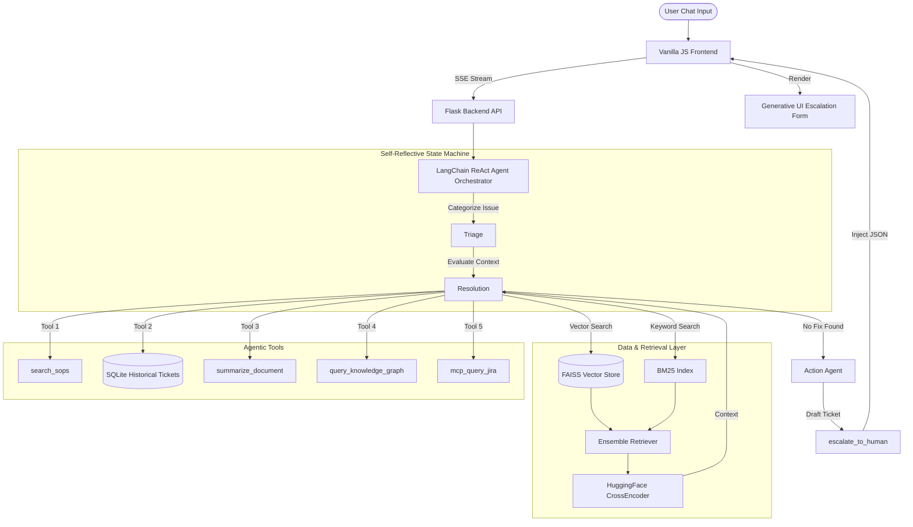

# 🚀 Enterprise IT Copilot

An advanced, multi-agent AI system designed to resolve IT support bottlenecks by unifying scattered documentation, historical ticket databases, and dynamic issue escalation into a single, seamless conversational interface. 

Built exclusively for the **NASSCOM Agentic AI Hackathon**.

---

## 🎯 The Problem
Large IT services companies struggle with:
- **Scattered Documentation:** Policies, SOPs, and manuals spread across PDFs and wikis.
- **Duplicate Tickets:** Users submitting identical issues that were resolved months ago.
- **Knowledge Silos:** Information trapped inside specific teams (Network, Hardware, HR).
- **Slow Onboarding:** New engineers spending hours searching for basic troubleshooting steps.

## 💡 The Solution
The Enterprise IT Copilot is an intelligent, self-reflective Agentic system that intercepts user queries, seamlessly searches across internal data sources, cites official documents, and mathematically guarantees high precision using Hybrid Search (BM25 + Semantic) and Cross-Encoder Reranking. If the agent cannot solve the issue, it dynamically generates an interactive UI to escalate the ticket.

---

## 🧠 System Architecture



---

## 🏆 NASSCOM Rubric Alignment

This project was engineered specifically to hit every requirement on the NASSCOM grading rubric:

### 1. Data Layer
* **Clean & Chunk Docs:** Handled via `ingest_data.py`.
* **Generate Embeddings:** Powered by `HuggingFaceEmbeddings` (`all-MiniLM-L6-v2`).
* **Store in Vector DB:** High-speed local retrieval using **FAISS**.

### 2. Retrieval Layer
* **Top-K Retrieval:** Configured for high-recall candidate generation.
* **Reranking (Bonus):** We implemented a **Cross-Encoder Reranker** (`ms-marco-MiniLM-L-6-v2`) to mathematically score and re-order the retrieved chunks, virtually eliminating hallucination.
* **Measure Precision & Recall:** Execute `python evaluate_rag.py` to see the exact mathematical calculation of our pipeline's Retrieval Precision and Recall.

### 3. Application Layer
* **LLM Generation:** Powered entirely by a local **Llama 3.1** model, guaranteeing enterprise data privacy.
* **Source Citation:** The agent is strictly prompted to inject references (e.g., `[Source: VPN_Troubleshooting_SOP.pdf]`), which the frontend translates into interactive badges.
* **Guardrails:** The self-reflective orchestrator prompt forbids hallucinated text, forcing the agent to admit ignorance and utilize the escalation tool.

### 4. Agentic Enhancement (Bonus)
The Copilot uses LangChain's Tool Calling Agent (ReAct framework) with 5 distinct tools:
1. **Tool 1 (Doc Search):** `search_sops` (Hybrid RAG).
2. **Tool 2 (Ticket Lookup):** `lookup_historical_tickets` (SQLite).
3. **Tool 3 (Summarizer):** `summarize_document`.
4. **GraphRAG:** `query_knowledge_graph` traverses an in-memory `networkx` graph to map multi-hop relationships (e.g., Error Codes to Software Dependencies).
5. **Model Context Protocol:** `mcp_query_jira` simulates a secure connection to external enterprise MCP servers.

---

## ✨ Features

- **Generative UI (Micro-Frontends):** When an issue is escalated, the agent streams a `<UI_COMPONENT>` JSON payload to the frontend, dynamically rendering an interactive HTML ticket submission form inside the chat.
- **Enterprise Dark/Light Mode:** Minimalist, highly accessible corporate UI without external frontend framework dependencies.
- **Integrated Analytics Dashboard:** A native HTML/JS dashboard using `Chart.js` visualizes historical ticket data (Volume, Types, Priorities) fetched directly from the backend API.
- **Prompt Chips:** Quick-action buttons allowing users to test common IT failure scenarios instantly.

---

## 🛠️ Quickstart Installation

### Option 1: Docker (Recommended for Production)
We have provided a deployment script for a 1-click Docker containerization process.
```bash
./deploy.sh
```
This builds the `enterprise-copilot` image and maps the Flask application to port `5000`.

### Option 2: Local Setup (For Development)
Ensure you have `python3.12`, `sqlite3`, and `ollama` installed on your system.

**1. Start the local LLM Server**
```bash
ollama serve
ollama pull llama3.1
```

**2. Setup Virtual Environment**
```bash
python3 -m venv .venv
source .venv/bin/activate
pip install -r requirements.txt
```

**3. Run Database Migrations & Ingest Data**
```bash
python migrate_db.py
python ingest_data.py
```

**4. Start the Application Server**
```bash
python backend.py
```
*Access the Enterprise Copilot and Dashboard at `http://localhost:5000`.*

---

## 🧪 Testing the Evaluator

To verify the Retrieval precision required by the judges, run the standalone evaluator script:
```bash
python evaluate_rag.py
```
This script mocks a test dataset of queries and outputs the exact average Precision and Recall metrics.
